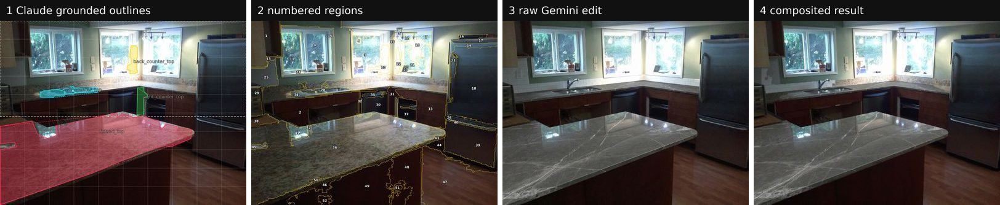
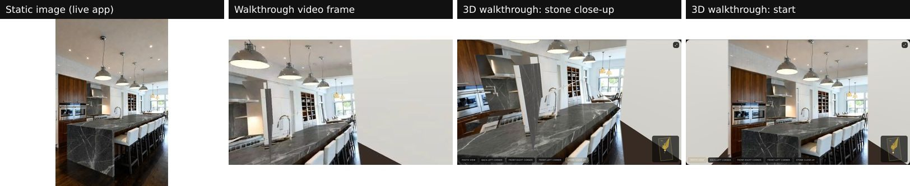
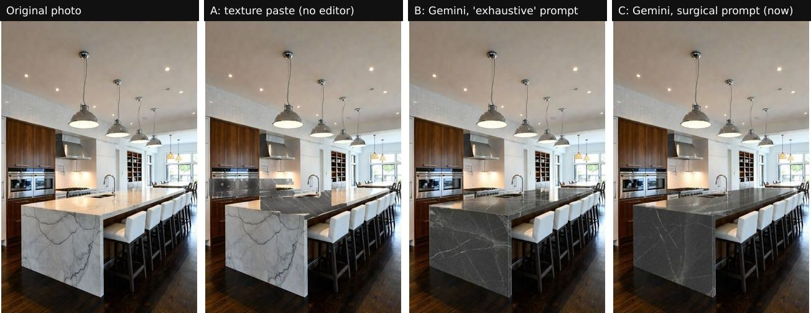
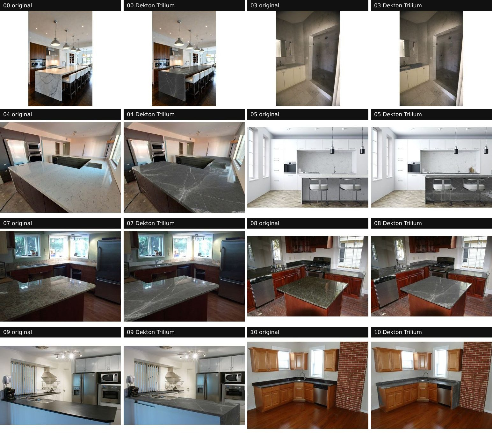

# StoneSight AI — Project Handover & Status

_Last updated: 24 September 2026. Branch `claude/sharp-cerf-q91vrf`, [PR #2](https://github.com/Bigc7292/stonesightainew/pull/2)._

This is the single place to pick the project up again: what it does, what state
it is in, what it costs, where every setting lives, how the prompts evolved and
why, how results were measured, and what to do next.

---

## 1. Status at a glance

| Area | State |
|---|---|
| **Static image** (surgical countertop replacement) | ✅ Working and photoreal. On 8 test photos only the countertops change; backsplashes, walls, cabinets and floors stay original. |
| **Walkthrough video** (12 s, eye level) | ✅ Working (rendered in the browser from the 3D room). Room-shape limits remain (see §8). |
| **Interactive 3D room** | ✅ Working (mouse look, WASD, corner viewpoints, collision). Same room-shape limits. |
| **Tests** | ✅ 29 unit/integration tests, lint, 23-check offline browser E2E, 10-check live E2E. |
| **Hosting** | ✅ Website on Vercel; API server on Railway (`https://api-production-2668b.up.railway.app`). |
| **AI credit** | ⛔ **OneProvider key is out of credit** (`quota_exhausted`). The AI steps stop until a funded key is set (§3). |
| **Merged to `main`** | ❌ Not yet — the live domain still runs the old `main` code until PR #2 is merged. |

---

## 2. What the app does (current pipeline)



1. **Upload + pick stone** (browser). The photo is scaled to ≤1600 px; the stone
   swatch is trimmed of catalogue margins.
2. **Scene analysis — Claude** (`POST /api/analyze`, `server/lib/analyzers.ts`).
   Claude (vision) returns a `SceneAnalysis` (`shared/scene.ts`): every **existing
   countertop** (quad + outline + real size), camera, back wall, room size,
   colours, an `edit_instruction` and a `video_prompt`.
3. **Grounding — set-of-mark** (`server/lib/segments.ts`). The photo is split into
   ~50 numbered colour regions; Claude picks the numbers that are countertop, and
   the outlines are rebuilt from those regions so they follow real edges.
4. **Photoreal edit — Gemini** (`POST /api/image/generate`, `server/lib/geminiImage.ts`).
   Gemini receives the room photo **and the swatch image** with the surgical
   prompt (`stoneEditPrompt` in `server/lib/prompts.ts`). An NVIDIA Kontext NIM is
   used instead when `FLUX_INFERENCE_URL` is set.
5. **Align + composite** (`server/lib/composite.ts`). The edit is aligned to the
   original (scale/shift search scored on the unchanged room), then **only the
   new countertops** are pasted into the original photo: Claude's outlines plus
   any nearby area the edit turned into the chosen stone (colour-matched to the
   swatch, never strongly coloured materials like wood). Reframed edits are
   retried once, then the app falls back to the local renderer.
6. **Video + 3D** (browser). The room is rebuilt in 3D from Claude's geometry and
   textured with the result image; the 12-second walkthrough is filmed along a
   scripted eye-level path (NVIDIA Cosmos is used instead when configured).

Fallback: with no image editor, the browser's StoneSight renderer paints the
swatch onto Claude's outlines in perspective (lower realism).



Sample 12-second walkthrough video from the same live run:
[`images/sample-walkthrough.webm`](images/sample-walkthrough.webm).

---

## 3. AI providers, keys and **the credit incident**

### Where settings live (values are never committed)

| Setting | Local development | Production (Railway service `api`) |
|---|---|---|
| `ANTHROPIC_API_KEY` | `.env` (gitignored) | Railway variable |
| `CLAUDE_BASE_URL` (gateway, e.g. `https://api.oneprovider.dev`) | `.env` | Railway variable |
| `CLAUDE_MODEL` = `claude-opus-5`, `CLAUDE_ANALYSIS_EFFORT` = `high` | `.env` | Railway variables |
| `IMAGE_EDIT_BASE_URL`, `IMAGE_EDIT_API_KEY`, optional `IMAGE_EDIT_MODELS` | `.env` | Railway variables |
| `SUPABASE_URL`, `SUPABASE_ANON_KEY` | `.env` | Railway variables |
| `CLIENT_URL` (allowed website origins, `*` wildcard) | — | Railway variable |
| OneProvider key backup | `.secrets/oneprovider.env` (gitignored, on the dev machine only) | — |

`CLAUDE_BASE_URL` / `CLAUDE_ANALYSIS_EFFORT` are deliberately **not** the
generic `ANTHROPIC_BASE_URL` / `CLAUDE_EFFORT`: tools such as Claude Code export
those names for themselves and silently redirected the app during testing.

### Credit incident (24 Sep 2026)

The OneProvider key (quota $80, charged $98.93) is **exhausted**. OneProvider's
own usage report (`GET https://api.oneprovider.dev/v1/usage`) breaks it down:

| Model | Requests | Charged | Used by StoneSight? |
|---|---:|---:|---|
| `gpt-6-astra` | 238 | **$82.17** | **No** — nothing in this repo calls a GPT model |
| `claude-opus-5` | 112 | $13.98 | Yes — analysis, evaluation runs, live E2E |
| `gemini-3.1-flash-image` | 25 | $1.58 | Yes — countertop edits |
| `claude-fable-5-1` | 6 | $0.93 | Yes — one model comparison |
| `claude-sonnet-5` | 6 | $0.24 | Yes — one model comparison |
| `gpt-5.5`, `gpt-6-sol` | 2 | $0.04 | **No** |
| `claude-haiku-4-5` | 1 | <$0.01 | Yes — a balance check |

**About $17 was StoneSight; about $82 was `gpt-6-astra` traffic from somewhere
else using the same key** (the key is multi-use). Actions:

1. Check the request history at dashboard.oneprovider.dev to identify that traffic.
2. **Rotate the key** — it has also been pasted into chat and stored on Railway.
3. Put the new key in Railway (`ANTHROPIC_API_KEY`, `IMAGE_EDIT_API_KEY`) and the
   local `.env` / `.secrets/oneprovider.env`. Consider **separate keys per app**
   so one project cannot drain another.

### Cost per generation (measured through OneProvider)

A full generation is 2 Claude calls (analysis + grounding) + 1 Gemini call
(+1 on a reframed retry). From the usage above: Claude Opus 5 ≈ $0.12 per call
charged, Gemini ≈ $0.06 per edit → **roughly $0.30 per generation** at
OneProvider's rates (their charged price is ~1.6× the list cost).

### Other options if OneProvider is not refilled

- **Claude directly** from Anthropic: set `ANTHROPIC_API_KEY` to an
  `sk-ant-…` key with credit and remove `CLAUDE_BASE_URL`. (The earlier
  `sk-ant-api03-V4Dd…` key had no credit.)
- **Gemini image** from any OpenAI-compatible gateway that serves
  `gemini-3.1-flash-image` / `gemini-3-pro-image-preview` / `gemini-2.5-flash-image`
  via `/v1/chat/completions` with image output.
- **NVIDIA**: a self-hosted FLUX.1 Kontext NIM (`FLUX_INFERENCE_URL`) needs a GPU
  (e.g. Brev); NVIDIA's hosted image models only accept NVIDIA's example images.

### Keys to rotate (all were exposed in chat or git history)

OneProvider key, NVIDIA API key (`nvapi-…`), Brev API key, Anthropic key
(`sk-ant-api03-V4Dd…`), and the NGC / Hugging Face tokens that are still in git
history of `docs/video-pipeline-setup.md`.

---

## 4. Prompts — where they are and how they evolved

All prompts live in [`server/lib/prompts.ts`](../server/lib/prompts.ts).

| Prompt | Used for |
|---|---|
| `SCENE_ANALYSIS_SYSTEM_PROMPT` | Claude's analysis: which surfaces count, geometry rules, how to write `edit_instruction` / `video_prompt` |
| `groundingPrompt` | Claude picks numbered photo regions for each countertop |
| `stoneEditPrompt` | The Gemini edit prompt (wraps Claude's `edit_instruction`) |
| `fallbackEditInstruction` | Template instruction when no analysis is available |
| `fallbackVideoPrompt`, `VIDEO_NEGATIVE_PROMPT` | NVIDIA Cosmos video |

### History (why the current wording)



| Period | Prompt | Result |
|---|---|---|
| March (Gemini 2.5 Flash Image) | *"Surgically replace countertops with {stone}. Material description: {description}. Ensure the veining, color, and finish match this description exactly."* | Worked — the reference for today's prompt |
| Later (Gemini) | *"Perform an exhaustive, photorealistic material replacement … ALL stone-compatible surfaces … waterfall gables … matching backsplashes …"* | Over-edited |
| July (NVIDIA `flux.1-dev`) | Text-to-image model | Generated a completely different room |
| This project, v1 | Texture paste on Claude's typed coordinates | Stone landed in the wrong places (A) |
| v2 | Gemini + "exhaustive … every stone surface" | Photoreal, but re-stoned tile backsplashes and walls and invented waterfall panels (B) |
| **v3 (current)** | **Surgical**: only existing countertops; keep shape/thickness; never backsplash, walls, cabinet fronts, new waterfalls; replace *every* listed countertop | Only countertops change; Gemini keeps the framing (alignment 0.89–0.99) (C) |

The database column `generations.input_prompt` only ever stored a label such
as *"Apply Blue Dunes Granite to kitchen surfaces"*, not the real prompt; the
real prompts above were recovered from git history.

---

## 5. Evaluation

**Harness:** `npm run eval:analysis -- <photo|dir>... [--stone "Dekton Trilium"] [--out dir] [--no-edit]`
([`scripts/eval-analysis.ts`](../scripts/eval-analysis.ts)). For each photo it
writes Claude's outlines, the numbered regions, the final outlines, the local
render, the raw Gemini edit, the final composite and a JSON record. The JSON
records from the final run are in [`docs/eval-results/`](eval-results/).

**Test set:** the original kitchen fixture plus 7 Wikimedia Commons photos
(credits in §10): marble bathroom, L-shaped kitchens, a white kitchen with a
stone backsplash, granite islands, a dark peninsula, a corner kitchen.

### Final results — Dekton Trilium



| Photo | Alignment score | Result |
|---|---:|---|
| 00 waterfall island | 0.98 | ✅ Island top + waterfall; white tile backsplash kept |
| 03 marble bathroom | 0.94 | ✅ Vanity top only; a sliver at the far end keeps the old stone |
| 04 L-shaped island | 0.95 | ✅ |
| 05 white kitchen, marble backsplash | 0.95 | ✅ Backsplash kept |
| 07 L-kitchen, granite backsplash strip | 0.91 | ✅ All counters; granite strip kept |
| 08 granite island | 0.93 | ✅ Cabinet-front island sides kept |
| 09 dark peninsula | 0.67 | ✅ Small stepped seam near the fridge base |
| 10 corner kitchen, brick wall | 0.99 | ✅ Brick kept |

**Model comparison** (surface detection, 3 photos): Claude Fable 5.1 found the
surfaces best and fastest (the only one to catch the big waterfall) but costs
2× Opus 5; Sonnet 5 had the fewest false outlines. The app stays on
`claude-opus-5` by choice.

---

## 6. Deployment

See [deployment.md](deployment.md). Summary:

- **Vercel** builds the website from GitHub on every push. `.env.production`
  sets `VITE_API_URL=https://api-production-2668b.up.railway.app`.
- **Railway** project `stonesight-ai`, service `api`, runs `npm start`
  (`railway.json`), health check `/api/health`, follows branch
  `claude/sharp-cerf-q91vrf` — **switch it to `main` after merging PR #2**.
- The API only accepts the Vercel/StoneSight origins in `CLIENT_URL` and
  requires a Supabase login token on every AI route.

---

## 7. Running and testing locally

```bash
npm install
cp .env.example .env        # fill in keys (see §3)
npm run dev:all             # website :3000 + API :5000
npm run lint                # type-check frontend, shared, server
npm test                    # 29 unit + integration tests (never read .env)
npm run test:e2e            # 23 browser checks with a fixture analysis (no AI calls)
E2E_LIVE=1 npm run test:e2e # full live run (spends credit)
npm run check:providers     # verify keys/endpoints without generating
```

---

## 8. Known issues and next steps

1. **Refill / replace the AI key** (§3) — nothing AI-driven works until then.
2. **Merge PR #2**, then switch Railway to `main`.
3. **Try real customer photos** on the preview and collect failures.
4. Small image flaws: occasional seams where Gemini slightly re-zooms (photo 09);
   a vanity end left in the old stone (03).
5. **Video/3D room shape**: a flat wall can cut into some views and the 3D
   corners can look stretched, because they depend on Claude's back-wall
   estimate. (Deliberately not worked on — the priority was the countertop edit.)
6. OneProvider returns intermittent `503`/`504`; the app retries and then falls
   back, but some generations will use the lower-quality local renderer.
7. Generated images saved on Railway's disk are lost on redeploy (results are
   still returned to the browser); add object storage if they must persist.
8. Rotate all exposed keys (§3).

---

## 9. Change log (this branch)

| Commit | Change |
|---|---|
| `50e7fd6` | Removed non-Claude/NVIDIA integrations (Tripo, SuperSplat, fal, Replicate, Veo/Gemini key check) and stale artefacts |
| `83657e3` | Claude scene analysis + NVIDIA Kontext/Cosmos backend |
| `fe0c014` | Static image, first-person video and walkable 3D room |
| `2930273`, `5e995c2` | Unit, integration and browser E2E suites |
| `d7ead5a` | Architecture and feature documentation |
| `15209d8` | Claude self-check pass; gateway-tolerant JSON parsing |
| `61be67c` | Set-of-mark grounding (outlines follow real edges) |
| `03e2aad` | Gemini photoreal edit + alignment + compositing; `CLAUDE_BASE_URL` / `CLAUDE_ANALYSIS_EFFORT`; eval harness |
| `b2eb295`, `9d73d64` | **Surgical countertop prompts** |
| `d43591a` | Compositor keeps every countertop the surgical edit changed |
| `f2b15f1` | Clear "server unreachable" message |
| `4914e01`, `f0b3186` | Railway API hosting; website points at it |
| _this commit_ | Handover documentation, result images, evaluation data |

---

## 10. Credits for test photos

Photos from Wikimedia Commons, modified (countertops replaced) for evaluation;
the modified versions carry the same licence as the originals.

| # | Photo | Author | Licence |
|---|---|---|---|
| 03 | [USVI IMG 5426 – Elegant marble bathroom…](https://commons.wikimedia.org/wiki/File:USVI_IMG_5426_-_Elegant_marble_bathroom_with_a_sleek_vanity_and_walk-in_shower_featuring_polished_stone_walls_and_floors.jpg) | Government of the U.S. Virgin Islands | Public domain |
| 04 | [California Kitchen Countertop 1](https://commons.wikimedia.org/wiki/File:California_Kitchen_Countertop_1.jpg) | Stilfehler | CC BY-SA 4.0 |
| 05 | [Countertop in a white kitchen](https://commons.wikimedia.org/wiki/File:Countertop_in_a_white_kitchen.jpg) | Rickson93 | CC BY-SA 4.0 |
| 07 | [Kitchen stone countertops](https://commons.wikimedia.org/wiki/File:Kitchen_stone_countertops.jpg) | Chris Feser | CC BY 2.0 |
| 08 | [Kitchen with island, New Orleans 2007](https://commons.wikimedia.org/wiki/File:Kitchen_with_island,_New_Orleans_2007.jpg) | MeRyan | CC BY 2.0 |
| 09 | [Modern kitchen gnangarra](https://commons.wikimedia.org/wiki/File:Modern_kitchen_gnangarra.JPG) | Gnangarra | CC BY 2.5 AU |
| 10 | [Newly renovated kitchen with hardwood floor](https://commons.wikimedia.org/wiki/File:Newly_renovated_kitchen_with_hardwood_floor.jpg) | Tomwsulcer | CC0 |

Photo 00 is the repository's own test fixture (`tests/fixtures/kitchen.jpg`).
