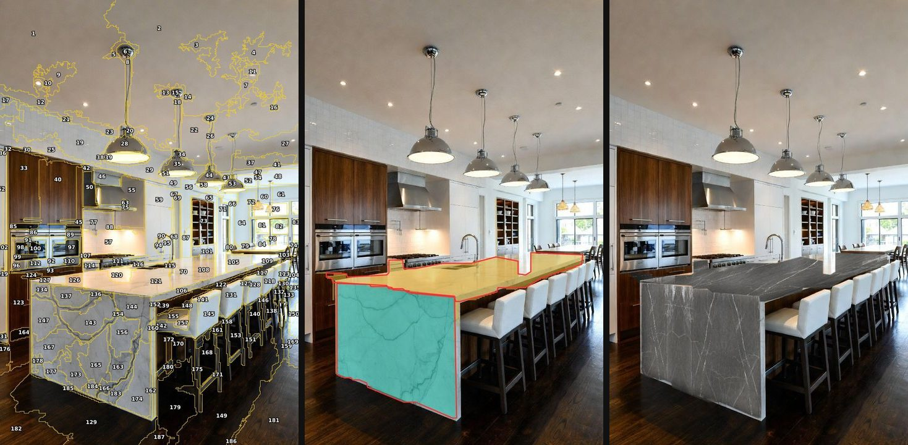
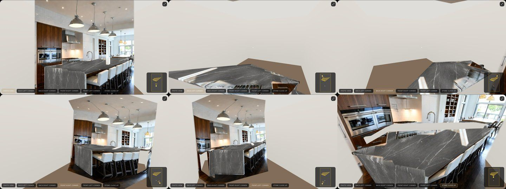

# Running StoneSight with Claude Code as the AI (no API keys)

StoneSight's only AI step that needs judgement is the **scene analysis**:
finding the countertops (and waterfall ends) in the customer's photo. In this
mode that step is done by **Claude Code itself**, in the same cloud
environment as the app, so no Anthropic, OneProvider, Gemini or NVIDIA key is
used. Everything after it — the stone render, the 12-second walkthrough video
and the interactive 3D room — is the app's own code.



*Left: the job image the server writes (photo split into ~180 numbered
regions). Middle: the answer Claude Code chose — gold = countertop tops, teal =
waterfall face, red = traced outlines. Right: the app's result.*



Video from the same run: [`images/claude-code-walkthrough.webm`](images/claude-code-walkthrough.webm).

## How it works

1. The API server runs with `CLAUDE_CODE_ANALYST=on`. `GET /api/health`
   reports `analysis: "claude-code"`, so the website runs its normal AI flow
   ("Claude Code is mapping your room's stone surfaces…").
2. `POST /api/analyze` (`server/lib/claudeCodeAnalyst.ts`) writes a job folder
   `claude-code/inbox/<id>/` with `photo.jpg`, `regions.jpg` (numbered regions)
   and `request.json`, then waits (default 30 min, `CLAUDE_CODE_ANALYST_TIMEOUT_S`).
3. Claude Code looks at `regions.jpg`, writes a draft
   `{ "top": [ids], "face": [ids] }`, checks it with
   `npm run analyst -- preview <id> <draft>` (draws `preview.jpg`), and submits
   it with `npm run analyst -- answer <id> <draft>`.
   `npm run analyst -- at <id> x,y` tells which region is under a point.
4. The server turns the regions into surfaces with the same code as the
   customer's own selection in the no-AI picker (`shared/manualScene.ts`),
   returns the scene, and the browser renders the image, video and 3D room.

Optional answer fields `room_type`, `summary`, `camera`, `back_wall`,
`room_estimate`, `colors` (see `shared/scene.ts`) override the generic room
used for the 3D room and video.

## Running it

```bash
npm run claude-code:run -- path/to/room.jpg "Dekton Trilium"
```

This starts the API server (Claude Code analyst on, API keys off, local test
sign-in) and the website, then drives Chromium through the customer flow:
sign in → upload → pick stone → Generate. When it prints
`[CLAUDE-CODE] job <id> waiting…`, answer the job as above. Outputs go to
`claude-code/results/<photo>-<time>/`:

| File | Output |
|---|---|
| `result.jpg` | static image with the new stone |
| `walkthrough.webm` (or `.mp4`) | 12-second first-person video |
| `3d-<viewpoint>.png` | the interactive 3D room from each viewpoint |
| `page.png`, `run.json` | the whole results page, and a run summary |

A full run on the test kitchen took about 10 minutes, mostly the video
encoding under software WebGL. `claude-code/` is gitignored: it holds
customer photos.

To run the servers for a person using the website instead of the script, start
the API with `CLAUDE_CODE_ANALYST=on npm run dev:all` and keep a Claude Code
session answering `npm run analyst -- list`.

## Limits

- It needs a Claude Code session watching the inbox, so it suits this cloud
  environment, demos and testing — not unattended public traffic. For the
  public site, customers get either the AI mode (funded API key) or the free
  "paint your countertops" mode, which needs no one.
- Quality of the image is the StoneSight renderer's (flat texture mapping in
  perspective), not the Gemini photoreal edit.
- Where a countertop and a wall share one colour region (the far end of the
  test island by the door frame), the analyst leaves that region out rather
  than paint the wall.
